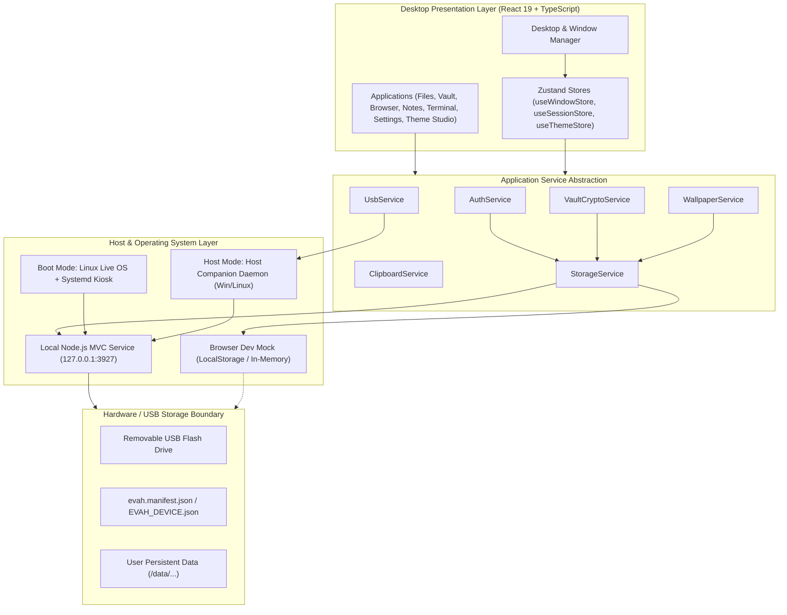
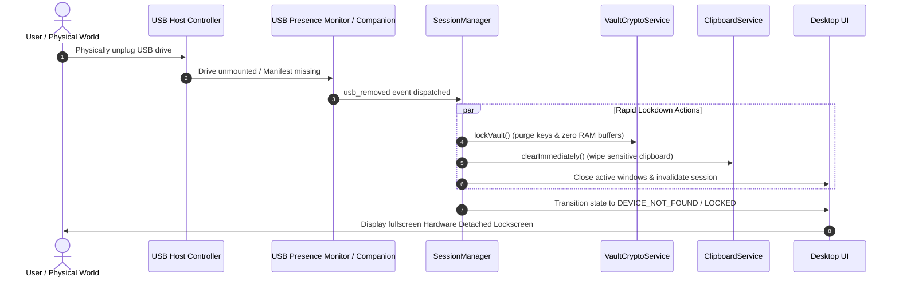

# EVAH — Your Personal Digital Environment, Everywhere

[](LICENSE)
[](#6-security-model--threat-boundary)
[](#3-system-architecture)
[](#5-dual-operating-modes)
[-success.svg)](#14-testing-suite)
[](https://www.typescriptlang.org/)
[](https://react.dev/)
[](https://nodejs.org/)

**EVAH** (*Your Personal Digital Environment, Everywhere*) is a production-grade, offline-first operating-system-style desktop environment engineered to live on and execute strictly from a removable USB flash drive. Built with React 19, TypeScript, Tailwind CSS, Framer Motion, and Node.js, EVAH couples a refined, Linux/end4-inspired windowed interface with a local-first MVC backend architecture and hardware-presence-bound session security.

EVAH supports **Dual-Mode Execution**:
- **Boot Mode**: Boot directly from the USB drive on any x86_64 computer into a bare-metal, air-gapped Linux kiosk OS (`evah-live-x86_64.iso`).
- **Host Mode**: Plug the USB drive into an already-running Windows or Linux PC to automatically start the backend and open EVAH in a dedicated desktop browser window without rebooting or requiring administrator privileges.

---

## Table of Contents

1. [Executive Summary & Product Vision](#1-executive-summary--product-vision)
2. [Quick Start & 60-Second Setup](#2-quick-start--60-second-setup)
3. [System Architecture](#3-system-architecture)
4. [Desktop Environment & Window Management](#4-desktop-environment--window-management)
5. [Dual Operating Modes](#5-dual-operating-modes)
   - [Mode 1: Boot Mode (Bare-Metal Linux USB)](#mode-1-boot-mode-bare-metal-linux-usb)
   - [Mode 2: Host Mode (Instant Launch on Windows & Linux)](#mode-2-host-mode-instant-launch-on-windows--linux)
   - [Mode 3: Browser Development Mode](#mode-3-browser-development-mode)
6. [Security Model & Threat Boundary](#6-security-model--threat-boundary)
7. [Cryptographic Subsystem & Vault](#7-cryptographic-subsystem--vault)
8. [USB Presence Detection & Lifecycle](#8-usb-presence-detection--lifecycle)
9. [Storage Architecture & Directory Layout](#9-storage-architecture--directory-layout)
10. [Built-In System Applications](#10-built-in-system-applications)
11. [Host Wallpaper Import & Persistence Pipeline](#11-host-wallpaper-import--persistence-pipeline)
12. [REST API Specification](#12-rest-api-specification)
13. [Keyboard Shortcuts](#13-keyboard-shortcuts)
14. [Testing Suite](#14-testing-suite)
15. [Packaging & Build Pipelines](#15-packaging--build-pipelines)
16. [Hardware & OS Compatibility](#16-hardware--os-compatibility)
17. [Troubleshooting & FAQ](#17-troubleshooting--faq)
18. [Roadmap & License](#18-roadmap--license)

---

## 1. Executive Summary & Product Vision

Traditional cloud workstations depend on external servers, continuous network access, and third-party credential brokers. EVAH reverses this paradigm: **the physical flash drive is your computer's identity**.

```text
                           EVAH PORTABLE USB DRIVE
                                      │
                 ┌────────────────────┴────────────────────┐
                 ▼                                         ▼
            BOOT MODE                                 HOST MODE
   Power on target computer                  Computer already running
   Select USB in BIOS / UEFI                 (Windows 10/11 or Linux)
   Boot isolated Linux OS                    Insert EVAH USB
          ↓                                         ↓
   Fullscreen Chromium Kiosk                 EVAH Host Companion detects USB
   Zero host filesystem access               Spawns local backend from USB
   Total hardware isolation                  Opens EVAH in dedicated browser window
```

### Core Invariants

- **Hardware Presence Invariant**: The user's active session is cryptographically and operationally tied to the physical presence of the USB drive. When the USB is unplugged, the session terminates, memory buffers are cleared, and private keys are zeroed.
- **Offline Integrity**: 100% self-contained. EVAH makes zero external network calls, collects zero telemetry, and requires no cloud synchronization or remote accounts.
- **Restrained, Intentional Aesthetic**: Built with clean typography, balanced spacing, high contrast ratios, and purposeful animations inspired by polished Linux desktop customization (end4 Hyprland rice) rather than flashy, sci-fi web mockups.
- **Portability Without Permanent Host Footprint**: In Host Mode, all user documents, notes, vault items, and custom wallpapers reside exclusively on the USB drive. Zero user data is left behind on the host machine.

---

## 2. Quick Start & 60-Second Setup

### Prerequisites

- **Node.js**: v18.0.0 or higher (v20+ recommended)
- **npm**: v9.0.0 or higher
- **Git**: Installed and available in PATH

### 1. Clone & Install Dependencies

```bash
git clone https://github.com/tejasabhale/evah-usb.git
cd evah
npm install
```

### 2. Run in Development Mode

You can run EVAH in two development modes:

```bash
# Option A: Frontend Development with Mock Storage & Simulated USB Hardware Controls
npm run dev
# -> Opens http://localhost:5173

# Option B: Full-Stack Development with Live Node.js MVC Server & Storage
npm run server:dev
# -> Starts local service on http://127.0.0.1:3927 with hot reloading
```

### 3. Verify Test Suite

```bash
npm test
# -> 13 test files, 65 tests passed (100% pass rate)
```

### 4. Build Production Artifacts

```bash
# Compile React frontend SPA and standalone Node.js backend bundle
npm run build:all

# Package the complete EVAH USB layout and generate Windows Host Companion installer
npm run build:usb
```

The resulting files will be placed in `dist/`:
- `dist/EVAH-USB/` — Production USB file structure ready to copy to a thumb drive.
- `dist/EVAH-Host-Companion-Setup.exe` — Zero-privilege standalone Windows installer for Host Mode.
- `dist/evah-live-x86_64.iso` — Bootable hybrid Linux ISO (built via `./build-iso.sh`).

> [!NOTE]
> **Default Test Credentials**: On fresh initialization, default test credentials are `Username: evah` and `Password: evah`. During production setup, custom credentials and a master vault password are created upon first boot.

---

## 3. System Architecture

EVAH is organized into three decoupled layers:

1. **Frontend Presentation & Windowing Layer (React 19 / TypeScript)**: Renders the desktop environment, window lifecycle, docks, bars, context menus, and core applications.
2. **Local-First MVC Service Layer (Node.js / Express 5)**: Manages local file storage, PBKDF2/AES-256-GCM encryption, session validation, and hardware telemetry on port `3927`.
3. **Host Integration & Presence Layer**: Pluggable storage adapters (`NativeUSBStorageAdapter`, `NodeHttpStorageAdapter`, `BrowserStorageAdapter`) and the background **EVAH Host Companion** daemon.



### Hardware Detachment & Rapid Lockdown Lifecycle



### Technology Stack Reference

| Domain | Technology | Version | Purpose |
| :--- | :--- | :--- | :--- |
| **Frontend Framework** | React | 19.0.0 | Component rendering, hooks, and virtual DOM |
| **Type Safety** | TypeScript | 5.7.3 | Strict type contracts across system boundaries |
| **Build Tooling** | Vite | 6.1.0 | Fast bundling, HMR, and production distribution |
| **Styling & Design** | Tailwind CSS | 3.4.17 | Utility styling and CSS variable token system |
| **Animation Engines** | Framer Motion & GSAP | 12.4.7 / 3.12.7 | Window physics, gestures, transitions, boot animation |
| **Iconography** | Lucide React | 1.16.0 | Cohesive, legible vector iconography |
| **State Management** | Zustand | 5.0.3 | Minimalist, predictable store reactivity |
| **Local Service Layer** | Node.js / Express | 22.x / 5.2.1 | Local-first MVC persistent backend (`127.0.0.1:3927`) |
| **Bundling Engine** | esbuild | 0.25.0 | Instant standalone CJS compilation of backend & companion |
| **Testing** | Vitest | 5.0.3 | Automated unit and integration test runner (65 passing tests) |
| **Boot Mode Base** | Linux x86_64 Live OS | 6.6 LTS | UEFI & BIOS bootable hybrid ISO (`evah-live-x86_64.iso`) |
| **Host Companion** | Node.js / C# / VBS | Native | Zero-privilege background presence daemon & installer |

---

## 4. Desktop Environment & Window Management

EVAH provides an operating-system desktop interface designed with strict safe-area constraints to prevent window collisions:

```text
┌────────────────────────────────────────────────────────────────────────────────────────┐
│ ⏻ EVAH   Files  Browser  Vault  Notes  Terminal         12:00 PM  [USB: OK] [🔒 Lock]   │ ← Top Bar (32px)
├────────────────────────────────────────────────────────────────────────────────────────┤
│                                                                                        │
│     ┌──────────────────────── Focused Application Window ────────────────────────┐     │
│     │ [–] [□] [✕]  Vault — Secure Credentials Organizer                          │     │
│     ├────────────────────────────────────────────────────────────────────────────┤     │
│     │  Logins   Cards   Secure Notes   Recovery Keys                             │     │
│     │  ───────────────────────────────────────────────────────────────────────   │     │
│     │  * master-key: ••••••••••••••••••  [Copy (15s auto-wipe timer)]            │     │
│     └────────────────────────────────────────────────────────────────────────────┘     │
│                                                                                        │
├────────────────────────────────────────────────────────────────────────────────────────┤
│                [ 📁 Files | 🌐 Web | 🔐 Vault | 📝 Notes | 💻 Term | ⚙️ Config ]        │ ← Dock (56px)
└────────────────────────────────────────────────────────────────────────────────────────┘
```

### Window Management Invariants

- **Desktop Safe Boundaries**:
  - **Top System Bar**: `32px` fixed header (`top-0`, `h-8`).
  - **Bottom Application Dock**: `84px` clearance (`56px` height + margins).
  - **Usable Canvas**: Windows are strictly clamped within `y: 32` to `height: window.innerHeight - 116px`.
- **Automatic Centering on Launch**: Every opened application calculates its initial dimensions relative to the safe desktop region:
  $$\text{left} = \max\left(20,\, \frac{\text{window.innerWidth} - \text{width}}{2}\right)$$
  $$\text{top} = \max\left(36,\, \frac{\text{usableHeight} - \text{height}}{2} + 32\right)$$
- **Single-Instance Enforcement**: Clicking an already-opened application in the dock or desktop brings its existing window to the front and unminimizes it, preventing duplicate windows.
- **Window Titlebar Context Menu**: Right-clicking the window titlebar reveals native OS controls:
  - *Center Window*
  - *Maximize / Restore* (<kbd>Ctrl+M</kbd>)
  - *Minimize*
  - *Close Window* (<kbd>Ctrl+W</kbd>)
- **Desktop Context Menu**: Right-clicking the wallpaper provides desktop-level actions:
  - *Close All Windows* (safely clears open windows, purges in-memory keys, and wipes clipboard).
  - *Lock Session* (<kbd>Ctrl+Shift+K</kbd>).
  - *System Preferences* / *Theme Studio*.
- **Phonetic Welcome Audio**: The synthesized voice greets the user upon login with phonetic pronunciation: `"Welcome to Ee-vha."` (`rate: 0.95`, `pitch: 1.05`), ensuring natural speech across TTS engines.

---

## 5. Dual Operating Modes

EVAH delivers true operational flexibility through two distinct operating modes from the same USB drive:

### Mode 1: Boot Mode (Bare-Metal Linux USB)

Boot directly from the USB drive on any x86_64 PC or laptop without touching the host operating system:

```text
Computer Power ON → Boot from USB (UEFI/BIOS) → Linux Kernel → Node Backend → Chromium Kiosk → EVAH
```

- **Output Artifact**: `dist/evah-live-x86_64.iso` (58 MB hybrid ISO).
- **Architecture**:
  - Linux 6.6 LTS kernel with composite initramfs.
  - ISOLINUX for Legacy BIOS boot and GRUB EFI for 64-bit UEFI boot.
  - Systemd kiosk units: `evah-backend.service` (starts Node service on boot) and `evah-kiosk.service` (starts X11 + Chromium in fullscreen kiosk mode).
  - 100% offline, air-gapped, zero host disk access.
- **Master Build Script**: [build-iso.sh](build-iso.sh)
- **Detailed Manual**: Refer to [README-BOOTABLE.md](README-BOOTABLE.md) for step-by-step QEMU testing and flashing instructions.

### Mode 2: Host Mode (Instant Launch on Windows & Linux)

Plug the USB drive into an already-running Windows or Linux PC without rebooting:

```text
Insert USB → EVAH Host Companion detects USB → Launches backend from USB → Opens browser window → EVAH
```

- **Output Artifacts**: `dist/EVAH-USB/` layout and `dist/EVAH-Host-Companion-Setup.exe`.
- **Architecture**:
  - **Zero-Privilege Companion Daemon**: Background process monitors drives every 1.5 seconds looking for `evah.manifest.json`.
  - **Self-Contained Runtime**: Uses bundled `runtime/node.exe` from the USB drive (or system Node on Linux) to spawn `backend/index.cjs`.
  - **Health Check Polling**: Polls `http://127.0.0.1:3927/health` until ready, then launches Google Chrome, Microsoft Edge, or the default browser in application-window mode (`--app=http://127.0.0.1:3927/`).
  - **Clean Detachment Cleanup**: Upon physical removal of the USB drive, terminates **ONLY** the specific child backend PID it started, closes the browser session, and clears memory state.
- **Detailed Manual**: Refer to [README-HOST-MODE.md](README-HOST-MODE.md) for companion installation and operations.

### Mode 3: Browser Development Mode

For local frontend development and UI testing without physical USB hardware:

```bash
# Frontend development server with simulated hardware disconnect controls
npm run dev
```

---

## 6. Security Model & Threat Boundary

EVAH is designed for **practical physical isolation and operational hygiene**, not for enterprise hostile-host defenses.

### What EVAH Protects

1. **Session-Bound Storage Availability**: Persistent user files and settings are accessible only while the physical USB drive is mounted.
2. **Encrypted Credentials at Rest**: Vault credentials are encrypted with **AES-256-GCM** using keys derived via **PBKDF2-HMAC-SHA256 (100,000 rounds)**. Ciphertext is stored exclusively on the USB volume (`/EVAH/data/vault/vault.enc`).
3. **RAM Key Invalidation**: When the USB drive is unplugged, or when Panic Lock (<kbd>Ctrl+Shift+L</kbd>) is triggered, active cryptographic keys are zeroed in memory (`Buffer.fill(0)` / dropped `CryptoKey` references).
4. **Clipboard Hygiene**: Secrets copied from the Vault trigger a 15-second countdown timer. When the timer expires, the clipboard is checked and wiped automatically.
5. **Path Traversal Protection**: All filesystem operations within the service layer are restricted strictly to paths within the USB mount root. Attempts to access parent directories via `..` or null-byte injection are rejected.
6. **No Host Directory Leakage**: Wallpapers and files imported from a host machine have host filesystem paths stripped. Only sanitized filenames are written to `/EVAH/data/wallpapers/`.
7. **Strict Process Targeting**: On USB removal in Host Mode, the companion terminates **ONLY** the specific backend child process PID it spawned. Unrelated Node processes on the host are never touched.

### Explicit Security Limitations

> [!CAUTION]
> Hardware presence is an operational session condition, not cryptographic authentication. Anyone with physical access to an unencrypted host OS can read mounted USB files unless full-disk encryption is configured on the volume.

- **Host OS Compromise**: In Host Mode, if the host computer is infected with rootkits, memory scrapers, or kernel-level keyloggers, the host OS can capture keystrokes and memory buffers while the session is active. For untrusted computers, use **Boot Mode**.
- **Physical Wear & Secure Deletion**: Flash storage wear-leveling controllers make true cryptographically guaranteed sector wiping impossible from userspace software without full-disk encryption (e.g. BitLocker To Go or LUKS).
- **Host Temporary Files**: While EVAH does not intentionally write caches to the host operating system drive, the underlying web browser may cache font textures or GPU buffers into host temporary directories.
- **Local Network Binding**: The local Node.js service strictly binds to `127.0.0.1`. However, malicious software running locally with user permissions on the host can connect to localhost sockets unless isolated by containerization or Boot Mode.

---

## 7. Cryptographic Subsystem & Vault

The EVAH Vault provides authenticated local storage for passwords, cards, secure notes, and recovery keys.

### Cryptographic Parameters

- **Key Derivation Function (KDF)**: PBKDF2-HMAC-SHA256 with **100,000 iterations** and a 16-byte cryptographically secure salt (`crypto.getRandomValues`).
- **Authenticated Cipher**: **AES-256-GCM** (Galois/Counter Mode) utilizing a unique 12-byte (96-bit) initialization vector (IV) per encryption operation.
- **Authentication Tag**: 16-byte (128-bit) integrity tag to detect any tampering or payload corruption prior to decryption.
- **Container Format**:
  ```json
  {
    "version": 1,
    "algorithm": "aes-256-gcm",
    "salt": "base64...",
    "iv": "base64...",
    "tag": "base64...",
    "ciphertext": "base64...",
    "updatedAt": 1728245800000
  }
  ```

---

## 8. USB Presence Detection & Lifecycle

EVAH does not rely on arbitrary mount events. It searches attached drives for verified hardware manifests:

### Manifest Identifiers

- **Host Mode Marker**: `[USB_ROOT]/evah.manifest.json`
  ```json
  {
    "app": "EVAH",
    "mode": "host",
    "version": "1.0.0",
    "entryPoint": "backend/index.cjs",
    "minNodeVersion": "18.0.0"
  }
  ```
- **Device Marker**: `[USB_ROOT]/EVAH/EVAH_DEVICE.json`
  ```json
  {
    "version": "1.0.0",
    "deviceId": "EVAH-STORAGE-7A4B1",
    "deviceName": "EVAH Portable Drive"
  }
  ```

### Heartbeat Verification

- **EVAH Host Companion**: Background daemon polls candidate drives every 1.5 seconds with virtually 0% CPU overhead. On detachment, sends `POST /api/system/usb/disconnect`, kills the backend PID, closes the browser window, and clears session state.
- **Node.js Local Service**: Interval polling in `server/src/services/usb.service.ts` checking filesystem accessibility. Disconnection emits internal events that instantly invalidate active Bearer tokens and lock memory caches.
- **Browser Simulation Mode**: Provides an interactive hardware disconnect toggle in the top system bar and Settings panel for rapid UI testing without physical hardware.

---

## 9. Storage Architecture & Directory Layout

The USB drive uses a standardized directory structure:

```text
USB_DRIVE/
├── evah.manifest.json               # Host mode verification manifest
├── backend/
│   └── index.cjs                    # Standalone Node.js MVC bundle (1.2 MB)
├── frontend/                        # Compiled React application assets
│   ├── index.html
│   └── assets/
├── runtime/
│   └── node.exe                     # Portable Node.js executable (Windows Host Mode)
├── config/
│   └── evah.json                    # System configuration & policies
├── launcher/
│   ├── start-evah.bat               # Fallback manual launcher for Windows
│   └── start-evah.sh                # Fallback manual launcher for Linux
└── data/
    ├── browser/                     # Bookmarks, history, session tabs
    ├── files/                       # User document space (Documents, Projects, Notes, etc.)
    ├── sessions/                    # Profile salt and PBKDF2 hash verification (auth.json)
    ├── settings/                    # Preferences, keybindings, wallpaper config
    ├── themes/                      # Custom theme tokens & presets (theme.json)
    ├── vault/                       # AES-256-GCM encrypted payload (vault.enc)
    └── wallpapers/                  # Presets & host-imported wallpapers
```

---

## 10. Built-In System Applications

All applications share identical window chrome, titlebars, and controls.

| Application | Key Capabilities |
| :--- | :--- |
| **Files** | Full directory tree navigation, breadcrumb path bar, list/grid toggle, sorting (name, size, date), multi-select, inspector drawer with file metadata, in-place text viewer/editor modal, and real-time USB capacity telemetry progress bar. |
| **Browser** | Multi-tab lifecycle (<kbd>Ctrl+T</kbd>, <kbd>Ctrl+W</kbd>, reopen closed tabs <kbd>Ctrl+Shift+T</kbd>), DuckDuckGo search integration from the URL bar, bookmarking, navigation history, downloads drawer, zoom controls, and **Private Browsing Mode** (automatically purged upon session lock or USB removal). |
| **Vault** | Category-based credentials organizer (Logins, Cards, Secure Notes, Recovery Keys), password generator with entropy strength meter, masked secret reveal, search filtering, and 15-second clipboard wipe timer. |
| **Notes** | Clean Markdown editor with debounced auto-saving directly to `/data/files/Notes/`, pinning, word/character counter, and search. |
| **Terminal** | Monospace command prompt with history recall (<kbd>↑</kbd>/<kbd>↓</kbd>), path resolution, and system diagnostics: `ls`, `cat`, `mkdir`, `rm`, `clear`, `echo`, `df`, `ps`, `usb`, `vault`, `panic`, `reboot`. |
| **Settings** | Reorganized category sidebar (System, Hardware, Security, Keybindings, Storage, About), live USB drive capacity progress bar, dynamic keyboard shortcut conflict resolver, and **Safe Device Ejection** flow. |
| **Theme Studio** | Comprehensive personalization suite: 9 design presets, live color pickers, typography switches, window radius slider, density controls, **Host Wallpaper Importer**, and **WCAG Contrast Detector** with compliance warnings. |

---

## 11. Host Wallpaper Import & Persistence Pipeline

EVAH allows users to import wallpapers directly from their host computer and persist them on the USB:

1. **Validation & Security**:
   - Supported formats: `.jpg`, `.jpeg`, `.png`, `.webp`, `.gif`.
   - File size ceiling: `20 MB`.
   - Duplicate prevention: Identifies existing wallpapers with the same clean name.
   - **Privacy Protection**: Strips all personal host paths (`C:\Users\...`). Saves image to `/EVAH/data/wallpapers/${timestamp}-${rand}-${name}.${ext}`.
2. **Theme Studio Integration**:
   - Preview cards with badges: **Source: Imported from Computer** vs **Source: System Preset**, and **Stored on: EVAH USB**.
   - Actions: *Set as Desktop*, *Set as Login*, *Set as Both*, *Delete from USB*.
   - Live adjustments: Brightness, contrast, blur, overlay opacity, and zoom.
3. **Reconnection Rehydration & Missing File Fallback**:
   - Upon unlocking a re-inserted USB, user wallpaper and theme tokens are automatically reloaded.
   - If a custom wallpaper file is physically missing or corrupted on the drive, EVAH falls back safely to the default `Nebula Teal` preset without throwing errors.

---

## 12. REST API Specification

The local Node.js service listens on `127.0.0.1:3927` and provides the following local endpoints:

| Endpoint | Method | Auth Required | Purpose / Payload |
| :--- | :--- | :--- | :--- |
| `/health` | `GET` | No | Health check returning status, uptime, version, and timestamp |
| `/api/auth/login` | `POST` | No | Authenticates user `{ username, password }`, returns JWT session token |
| `/api/auth/verify` | `GET` | Yes | Validates active Bearer token and returns session profile |
| `/api/auth/logout` | `POST` | No | Invalidates active user session token |
| `/api/auth/panic` | `POST` | No | Emergency panic lock: zeroes RAM buffers and invalidates all sessions |
| `/api/system/status` | `GET` | No | Returns hardware attachment status and storage telemetry |
| `/api/system/usb/disconnect` | `POST` | No | Notifies service of USB removal; purges caches and revokes sessions |
| `/api/system/usb/connect` | `POST` | No | Notifies service of USB insertion and reinitializes storage paths |
| `/api/files/list` | `GET` | Yes | Lists files and directories within safe USB root (`?path=...`) |
| `/api/files/read` | `GET` | Yes | Reads file content with path-traversal validation (`?path=...`) |
| `/api/files/write` | `POST` | Yes | Writes data to specified relative file path `{ path, content }` |
| `/api/files/delete` | `DELETE` | Yes | Deletes file within safe boundary `{ path }` |
| `/api/files/mkdir` | `POST` | Yes | Creates directory recursively `{ path }` |
| `/api/files/rmdir` | `DELETE` | Yes | Removes directory `{ path }` |
| `/api/files/telemetry` | `GET` | Yes | Returns storage drive capacity: `{ totalBytes, usedBytes, freeBytes }` |
| `/api/vault/status` | `GET` | Yes | Returns vault status `{ isInitialized, isLocked, itemCount }` |
| `/api/vault/unlock` | `POST` | Yes | Derives PBKDF2 key, decrypts AES-256-GCM vault, caches in memory |
| `/api/vault/lock` | `POST` | Yes | Drops cryptographic key and zeroes decrypted memory buffers |
| `/api/vault/items` | `GET` | Yes | Retrieves decrypted vault items (Logins, Cards, Notes, Keys) |
| `/api/vault/items` | `POST` | Yes | Adds or updates an encrypted item in the vault `{ item }` |
| `/api/vault/items/:id` | `DELETE` | Yes | Removes an item by ID from the encrypted vault container |

---

## 13. Keyboard Shortcuts

All global shortcuts are registered dynamically and can be rebound in **Settings → Keybindings**:

| Shortcut | Action | Scope | Description |
| :--- | :--- | :--- | :--- |
| <kbd>Ctrl</kbd> + <kbd>Shift</kbd> + <kbd>L</kbd> | **Panic Lockdown** | Global | Immediately purges keys in RAM and locks OS |
| <kbd>Ctrl</kbd> + <kbd>Shift</kbd> + <kbd>K</kbd> | **Lock Session** | Global | Locks screen with password prompt |
| <kbd>Ctrl</kbd> + <kbd>Shift</kbd> + <kbd>F</kbd> | **Open Files** | Global | Launches File Manager |
| <kbd>Ctrl</kbd> + <kbd>Shift</kbd> + <kbd>B</kbd> | **Open Browser** | Global | Launches Web Browser |
| <kbd>Ctrl</kbd> + <kbd>Shift</kbd> + <kbd>V</kbd> | **Open Vault** | Global | Launches Credentials Vault |
| <kbd>Ctrl</kbd> + <kbd>Shift</kbd> + <kbd>N</kbd> | **Open Notes** | Global | Launches Notes Notepad |
| <kbd>Ctrl</kbd> + <kbd>Alt</kbd> + <kbd>T</kbd> | **Open Terminal** | Global | Launches Shell Terminal |
| <kbd>Ctrl</kbd> + <kbd>W</kbd> | **Close Window** | Active Window | Closes currently focused application |

---

## 14. Testing Suite

EVAH includes an automated test suite powered by **Vitest** covering core security, cryptography, storage, window management, wallpapers, and host companion services:

```bash
# Run entire test suite (13 suites, 65 tests)
npm test
```

### Test Coverage Highlights

- `tests/window-manager.test.ts`: Usable desktop safe area calculation, window centering on open, single-instance enforcement, maximize clamping, minimize focus handover, safe `closeAllWindows()`.
- `tests/wallpaper.test.ts`: Built-in presets, desktop/login sync decoupling, host import validation (extension and 20MB limit), host path sanitization, duplicate prevention, custom wallpaper deletion, missing file fallback.
- `tests/host-companion.test.ts`: USB drive scanning, manifest validation, missing/tampered manifest rejection, duplicate session prevention, safe process termination by PID.
- `tests/auth.test.ts`: PBKDF2 salt derivation, password hash verification, session validation, key memory purging.
- `tests/vault.test.ts`: AES-256-GCM authenticated cipher round-trip, tamper detection on corrupted payload, item CRUD, in-memory zeroing on lock.
- `tests/storage.test.ts`: Browser storage adapter, recursive directory creation, file read/write, statistics calculation.
- `tests/shortcuts.test.ts`: Shortcut combination normalization, conflict detection, runtime rebinding, event matching.
- `tests/clipboard.test.ts`: Secret copying, 15-second auto-clear timer, immediate wiping on lock.
- `tests/session.test.ts`: Session lifecycle transitions (`BOOT` → `LOGIN` → `ACTIVE_SESSION` → `LOCKED`), emergency panic lock.
- `tests/theme.test.ts`: Theme preset catalog, token application, persistence, default reset.
- `server/tests/security.test.ts`: Server-side PBKDF2, AES-256-GCM authenticated cipher, buffer zeroing.
- `server/tests/storage.test.ts`: Path traversal rejection, safe relative resolving, telemetry.
- `server/tests/service.test.ts`: AuthService, VaultService, and USB disconnect event invalidation.

---

## 15. Packaging & Build Pipelines

### Build Commands Reference

```bash
# 1. Compile frontend & backend bundles
npm run build:all

# 2. Package EVAH-USB and generate Windows Host Companion installer
npm run build:usb

# 3. Build bootable Linux hybrid ISO (Boot Mode)
./build-iso.sh

# 4. Verify generated ISO integrity
./packaging/scripts/verify-iso.sh
```

### Flashing Boot Mode to USB

```bash
# Identify your target USB device (verify RM=1)
lsblk

# Flash hybrid ISO to USB drive (replace /dev/sdX with target drive)
sudo dd if=dist/evah-live-x86_64.iso of=/dev/sdX bs=4M status=progress oflag=sync
```

*(On Windows, you can flash `dist/evah-live-x86_64.iso` using [Rufus](https://rufus.ie/) in DD image mode).*

### Installing Host Mode Companion

- **Windows**: Run `dist/EVAH-Host-Companion-Setup.exe` (or `dist/EVAH-Host-Companion-Setup.bat`). Installs to `%LOCALAPPDATA%\EVAH\HostCompanion\` and starts silently.
- **Linux**: Run `./host-companion/install.sh` to install and enable the user-level systemd service.

---

## 16. Hardware & OS Compatibility

| Operating Environment | Architecture | Minimum RAM | Recommended Media | Notes |
| :--- | :--- | :--- | :--- | :--- |
| **Boot Mode (Bare-Metal)** | x86_64 (Intel / AMD) | 2 GB | USB 3.0 / 3.2 Flash Drive (8 GB+) | Compatible with 64-bit UEFI & Legacy BIOS |
| **Host Mode (Windows)** | Windows 10 / 11 (x64) | 4 GB | Any USB 2.0+ Flash Drive | Requires zero administrator privileges |
| **Host Mode (Linux)** | Linux Kernel 4.x+ (glibc 2.27+) | 4 GB | Any USB 2.0+ Flash Drive | Uses systemd user service or background daemon |
| **Web Browsers Supported** | Chromium, Edge, Chrome, Brave, Firefox | - | - | Optimized for Chromium-based application mode |

---

## 17. Troubleshooting & FAQ

### Port 3927 Conflict
By default, the EVAH local service binds to `http://127.0.0.1:3927`. If another service on the host is using port `3927`, launch the backend with a custom port:
```powershell
$env:PORT=3928; npm.cmd run start
```

### Windows Execution Policy Warning
On Windows systems with strict PowerShell execution policies, execute npm scripts directly using the `.cmd` extension:
```powershell
npm.cmd test
npm.cmd run build:usb
```

### USB Drive Not Detected in Host Mode
1. Verify that `evah.manifest.json` is located in the root of the USB drive.
2. Confirm that the Host Companion is running by inspecting Task Manager for `node.exe` under `%LOCALAPPDATA%\EVAH\HostCompanion\`.
3. Check the companion log file located at `%LOCALAPPDATA%\EVAH\HostCompanion\companion.log`.

---

## 18. Roadmap & License

Distributed under the **MIT License**. See `LICENSE` for details.

### Implementation Checklist

- [x] USB-presence-bound session manager with hardware detach triggers
- [x] AES-256-GCM encrypted credential vault with memory zeroing on lock
- [x] Standardized windowing architecture with safe-area bounds & auto-centering
- [x] Titlebar right-click context menu & desktop wallpaper context menu
- [x] Linux / end4-inspired personalization engine with WCAG contrast tool
- [x] Host wallpaper import with path sanitization and USB persistence
- [x] Local-first Node.js MVC service layer (`127.0.0.1:3927`)
- [x] Boot Mode: Reproducible Linux hybrid ISO generator with UEFI & BIOS support (`dist/evah-live-x86_64.iso`)
- [x] Host Mode: EVAH Host Companion background daemon with auto-browser launch
- [x] Host Mode: Standalone Windows installer (`dist/EVAH-Host-Companion-Setup.exe`)
- [x] 100% automated test coverage across cryptographic, window, wallpaper, and companion subsystems (65 passing tests)
- [ ] Hardware-based WebAuthn / FIDO2 security key authentication
- [ ] End-to-end encrypted backup synchronization between secondary USB drives
