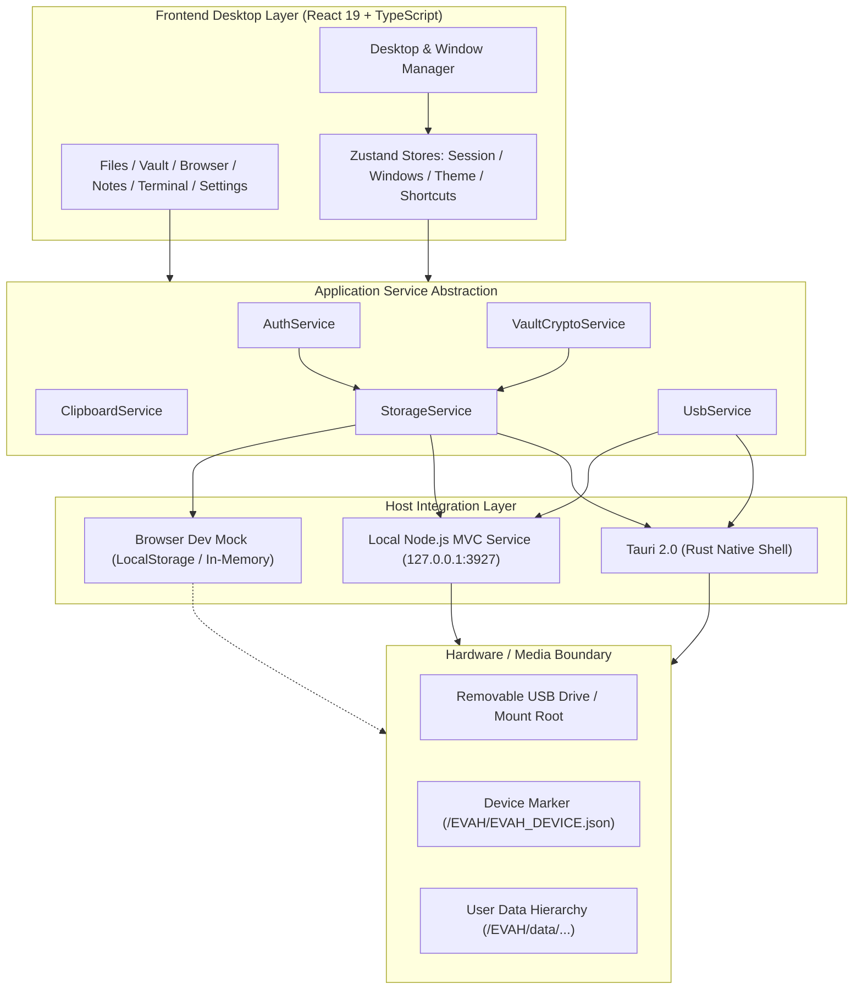
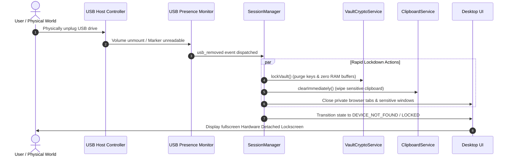

# EVAH — Your Personal Digital Environment, Everywhere

[](LICENSE)
[](README.md#5-security-model--explicit-limitations)
[](README.md#2-system-architecture)
[](README.md#13-testing-suite)

**EVAH** is a lightweight, portable, offline-first desktop environment designed to execute from and persist data strictly to a removable USB storage drive. Built using React, TypeScript, Tailwind CSS, and Framer Motion, EVAH couples a refined, Linux/end4-inspired windowed user interface with a native Tauri/Rust hardware presence monitor and an optional local-first Node.js MVC service layer.

---

## Table of Contents

1. [Overview & Product Vision](#1-overview--product-vision)
2. [System Architecture](#2-system-architecture)
3. [Technology Stack](#3-technology-stack)
4. [Project Structure](#4-project-structure)
5. [Security Model & Explicit Limitations](#5-security-model--explicit-limitations)
6. [USB Presence Detection & Lifecycle](#6-usb-presence-detection--lifecycle)
7. [Storage Architecture & Directory Layout](#7-storage-architecture--directory-layout)
8. [Cryptographic Subsystem & Vault](#8-cryptographic-subsystem--vault)
9. [Built-In System Applications](#9-built-in-system-applications)
10. [Design & Window Management System](#10-design--window-management-system)
11. [Running Modes](#11-running-modes)
12. [Keyboard Shortcuts](#12-keyboard-shortcuts)
13. [Testing Suite](#13-testing-suite)
14. [Troubleshooting](#14-troubleshooting)
15. [License & Roadmap](#15-license--roadmap)

---

## 1. Overview & Product Vision

EVAH delivers an isolated computing workspace that travels with the user on hardware media. All persistent assets—user documents, encrypted credentials, notes, browser states, window layouts, wallpapers, and styling tokens—reside within the USB volume. When the drive is inserted, the environment boots and authenticates. When the drive is detached, EVAH immediately invalidates active sessions, purges cryptographic keys from memory, and locks down private data.

### Core Tenets

- **Hardware Presence as a Session Invariant**: Session continuity requires continuous physical availability of the designated USB storage volume.
- **Offline Integrity**: Zero telemetry, zero cloud authentication, and zero reliance on external network infrastructure.
- **Restrained, Professional Aesthetic**: Built with clean typography, balanced spacing, high contrast ratios, and purposeful animations inspired by polished Linux desktop customization (end4 Hyprland rice) rather than flashy, AI-generated sci-fi tropes.
- **Strict Decoupling**: Components consume high-level service interfaces rather than raw hardware or filesystem primitives directly.

---

## 2. System Architecture

EVAH is organized into three cooperating layers:

1. **Frontend Presentation & Windowing Layer (React / TypeScript)**: Renders the desktop environment, window lifecycle, docks, bars, and applications.
2. **Native Shell / System Service Layer (Tauri / Rust or Local Node.js Service)**: Manages OS-level USB hardware detection, filesystem traversal protection, and native clipboard lifecycle.
3. **Storage Abstraction Layer**: Pluggable storage adapters (`NativeUSBStorageAdapter`, `NodeHttpStorageAdapter`, `BrowserStorageAdapter`) exposing an identical storage contract to the application suite.



### Hardware Detachment & Lockdown Lifecycle



---

## 3. Technology Stack

| Domain | Technology | Version | Purpose |
| :--- | :--- | :--- | :--- |
| **Frontend Framework** | React | 19.0.0 | Component rendering and virtual DOM |
| **Type Safety** | TypeScript | 5.7.3 | Static type contracts across system boundaries |
| **Build Tooling** | Vite | 6.4.4 | High-performance bundling and HMR |
| **Styling & Design** | Tailwind CSS | 3.4.17 | Utility styling and CSS variable token system |
| **Animation Engines** | Framer Motion & GSAP | 12.4.7 / 3.12.7 | Window physics, gestures, boot sequence |
| **Iconography** | Lucide React | 1.16.0 | Cohesive, legible system iconography |
| **State Management** | Zustand | 5.0.3 | Minimalist store reactivity |
| **Native Desktop Shell** | Tauri / Rust | 2.0 | Hardware USB monitoring and native window shell |
| **Local Service Layer** | Node.js / Express | 22.x / 5.2.1 | Local-first MVC persistent backend |
| **Testing** | Vitest | 5.0.3 | Automated unit and integration test runner |

---

## 4. Project Structure

```text
evah/
├── src/
│   ├── apps/                        # Application implementations
│   │   ├── browser/                 # Multi-tab web browser with private mode
│   │   ├── files/                   # Desktop file manager & inspector
│   │   ├── notes/                   # Local markdown notes app
│   │   ├── settings/                # System preferences & shortcut rebind UI
│   │   ├── terminal/                # Monospace CLI emulator & telemetry
│   │   ├── themes/                  # Theme Studio with WCAG contrast tool
│   │   └── vault/                   # AES-256-GCM credentials vault
│   ├── components/                  # Desktop chrome & shared primitives
│   │   ├── boot/                    # Boot sequence & phonetic welcome
│   │   ├── desktop/                 # Topbar, wallpaper canvas, dock
│   │   ├── lock/                    # Lock screen & panic lock overlays
│   │   ├── ui/                      # Standardized primitives (Button, Input, Toggle, etc.)
│   │   └── windows/                 # WindowFrame, WindowHeader, WindowControls
│   ├── hooks/                       # Custom hooks (shortcuts, layout, idle timer)
│   ├── services/                    # High-level domain services
│   │   ├── auth/                    # User authentication & PBKDF2 hashing
│   │   ├── clipboard/               # Timed auto-clearing clipboard service
│   │   ├── session/                 # Hardware-aware session lifecycle
│   │   ├── shortcuts/               # Dynamic shortcut registry & conflict detector
│   │   ├── storage/                 # Storage adapters (Tauri, Node HTTP, Browser)
│   │   ├── themes/                  # Token manager & preset catalog
│   │   ├── tts/                     # Phonetic speech synthesis engine
│   │   ├── usb/                     # Hardware presence detection & polling
│   │   └── vault/                   # Cryptographic vault & key management
│   ├── stores/                      # Zustand state slices
│   └── types/                       # Shared domain TypeScript declarations
├── server/                          # Local-First Node.js MVC Service Layer
│   ├── src/
│   │   ├── config/                  # Server configuration (localhost binding)
│   │   ├── controllers/             # Auth, File, Vault, System HTTP handlers
│   │   ├── errors/                  # Custom AppError hierarchy
│   │   ├── events/                  # Decoupled system event bus
│   │   ├── middleware/              # Auth, error handling, request logging
│   │   ├── models/                  # Backend data models
│   │   ├── repositories/            # Path-traversal-safe filesystem operations
│   │   ├── routes/                  # Express REST route definitions
│   │   ├── security/                # Node crypto PBKDF2 & AES-256-GCM
│   │   ├── services/                # Business logic & USB presence rules
│   │   ├── utils/                   # Structured logger & standardized responses
│   │   ├── validators/              # Payload input validators
│   │   ├── app.ts                   # Express application factory
│   │   └── index.ts                 # Server startup entry point
│   ├── tests/                       # Server-side integration test suite
│   ├── package.json                 # Standalone service definition
│   └── README.md                    # Server architecture documentation
├── src-tauri/                       # Native Tauri/Rust Implementation
│   ├── src/
│   │   ├── lib.rs                   # Tauri application entry point
│   │   ├── main.rs                  # Native executable wrapper
│   │   └── usb_monitor.rs           # Volume enumeration & marker verification
│   ├── Cargo.toml                   # Rust dependency configuration
│   └── tauri.conf.json              # Tauri window & security permissions
├── tests/                           # Vitest Unit & Integration Tests
│   ├── auth.test.ts                 # Authentication & PBKDF2 tests
│   ├── clipboard.test.ts            # Clipboard timeout & wiping tests
│   ├── session.test.ts              # Session lifecycle & panic lock tests
│   ├── shortcuts.test.ts            # Keyboard shortcut registry tests
│   ├── storage.test.ts              # Filesystem adapter tests
│   ├── theme.test.ts                # Design tokens & preset tests
│   └── vault.test.ts                # AES-256-GCM cryptographic tests
├── package.json                     # Root project configuration
├── vite.config.ts                   # Vite configuration
└── vitest.config.ts                 # Vitest test runner configuration
```

---

## 5. Security Model & Explicit Limitations

EVAH is designed for **practical physical isolation and operational hygiene**, not for enterprise hostile-host defenses. An accurate assessment of guarantees and limitations follows:

### What EVAH Protects

1. **Session-Bound Storage Availability**: Persistent user files and settings are accessible only while the physical USB drive is mounted.
2. **Encrypted Credentials at Rest**: Vault credentials are encrypted with **AES-256-GCM** using keys derived via **PBKDF2-HMAC-SHA256 (100,000 rounds)**. Ciphertext is stored exclusively on the USB volume (`/EVAH/data/vault/vault.enc`).
3. **RAM Key Invalidation**: When the USB drive is unplugged, or when Panic Lock (<kbd>Ctrl+Shift+L</kbd>) is triggered, active cryptographic keys are zeroed in memory (`Buffer.fill(0)` / dropped `CryptoKey` references).
4. **Clipboard Hygiene**: Secrets copied from the Vault trigger a 15-second countdown timer. When the timer expires, the clipboard is checked and wiped automatically.
5. **Path Traversal Protection**: All filesystem operations within the service and Tauri layer are restricted strictly to paths within the USB mount root. Attempts to access parent directories via `..` or null-byte injection are rejected.

### Explicit Security Limitations

> [!CAUTION]
> Hardware presence is an operational session condition, not cryptographic authentication. Anyone with physical access to an unencrypted host OS can read mounted USB files unless full-disk encryption is configured on the volume.

- **Host OS Compromise**: If the host computer is infected with rootkits, memory scrapers, or kernel-level keyloggers, the host OS can capture keystrokes and memory buffers while the session is active.
- **Physical Wear & Secure Deletion**: Flash storage wear-leveling controllers make true cryptographically guaranteed sector wiping impossible from userspace software without full-disk encryption (e.g. BitLocker To Go or LUKS).
- **Host Temporary Files**: While EVAH does not intentionally write caches to the host operating system drive, the underlying webview rendering engine (Chromium, WebKit, or WebView2) may cache font textures or GPU buffers into host temporary directories.
- **Local Network Binding**: The local Node.js service strictly binds to `127.0.0.1`. However, malicious software running locally with user permissions on the host can connect to localhost sockets unless isolated by containerization.

---

## 6. USB Presence Detection & Lifecycle

EVAH does not rely on arbitrary mount events. It searches attached drives for a verified hardware marker:

```text
USB_ROOT/EVAH/EVAH_DEVICE.json
```

```json
{
  "version": "1.0.0",
  "deviceId": "EVAH-STORAGE-7A4B1",
  "deviceName": "EVAH Portable Drive",
  "initializedAt": "2026-10-06T12:00:00Z",
  "storageLayoutVersion": 1
}
```

### Heartbeat Verification

- **Tauri Native Shell**: Background threads in `src-tauri/src/usb_monitor.rs` poll mounted drives at 1-second intervals. If the volume disappears or the device marker becomes unreadable, a native `usb_removed` event is dispatched over the IPC bridge.
- **Node.js Local Service**: Uses continuous interval polling in `server/src/services/usb.service.ts` checking filesystem accessibility. Disconnection emits internal events that instantly invalidate active Bearer tokens and lock memory caches.
- **Browser Simulation Mode**: Provides an interactive hardware disconnect toggle in the top system bar and Settings panel for rapid UI testing without physical hardware.

---

## 7. Storage Architecture & Directory Layout

The USB drive uses a standardized directory structure:

```text
USB_DRIVE/
└── EVAH/
    ├── EVAH_DEVICE.json             # Hardware identity marker
    ├── app/                         # Standalone executable binaries
    ├── assets/                      # Offline icons and media
    ├── config/                      # Host integration options
    └── data/
        ├── browser/                 # Bookmarks, history, session tabs
        ├── files/                   # User document space
        │   ├── Documents/
        │   ├── Downloads/
        │   ├── Notes/               # Markdown notes persisted by Notes app
        │   ├── Pictures/
        │   ├── Projects/
        │   └── Videos/
        ├── sessions/                # Ephemeral session auth receipts
        │   └── auth.json            # Salt and PBKDF2 hash verification
        ├── settings/                # OS preferences, shortcuts, audio config
        │   ├── config.json          # Core system policies
        │   ├── shortcuts.json       # Custom keyboard keybindings
        │   └── user.json            # Profile metadata
        ├── themes/                  # Custom theme tokens & presets
        │   └── theme.json           # Active colors, radii, text scales
        ├── vault/                   # Encrypted credential containers
        │   └── vault.enc            # AES-256-GCM encrypted payload
        └── wallpapers/              # Offline desktop background images
```

---

## 8. Cryptographic Subsystem & Vault

The EVAH Vault provides authenticated local storage for passwords, keys, and confidential notes.

### Cryptographic Parameters

- **Key Derivation Function (KDF)**: PBKDF2-HMAC-SHA256 with **100,000 iterations** and a 16-byte cryptographically secure salt (`crypto.getRandomValues`).
- **Authenticated Cipher**: **AES-256-GCM** (Galois/Counter Mode) utilizing a unique 12-byte (96-bit) initialization vector (IV) per encryption operation.
- **Authentication Tag**: 16-byte (128-bit) integrity tag to detect any tampering or payload corruption prior to decryption.
- **Container Format**:
  ```json
  {
    "version": 1,
    "algorithm": "aes-256-gcm",
    "salt": "base64...",
    "iv": "base64...",
    "tag": "base64...",
    "ciphertext": "base64...",
    "updatedAt": 1728245800000
  }
  ```

---

## 9. Built-In System Applications

All applications share identical window chrome, titlebars, and controls.

| Application | Key Capabilities |
| :--- | :--- |
| **Files** | Full directory tree navigation, breadcrumb path bar, list/grid toggle, sorting (name, size, date), multi-select, inspector drawer with file metadata, in-place text viewer/editor modal, and disk capacity telemetry indicator. |
| **Browser** | Multi-tab lifecycle (<kbd>Ctrl+T</kbd>, <kbd>Ctrl+W</kbd>, reopen closed tabs <kbd>Ctrl+Shift+T</kbd>), DuckDuckGo search integration from the URL bar, bookmarking, navigation history, downloads drawer, zoom controls, and **Private Browsing Mode** (automatically purged upon session lock or USB removal). |
| **Vault** | Category-based credentials organizer (Logins, Cards, Secure Notes, Recovery Keys), password generator with entropy strength meter, masked secret reveal, search filtering, and 15-second clipboard wipe timer. |
| **Notes** | Clean Markdown editor with debounced auto-saving directly to `/EVAH/data/files/Notes/`, pinning, word/character counter, and search. |
| **Terminal** | Monospace command prompt with history recall (<kbd>↑</kbd>/<kbd>↓</kbd>), path resolution, and system diagnostics: `ls`, `cat`, `mkdir`, `rm`, `clear`, `echo`, `df`, `ps`, `usb`, `vault`, `panic`, `reboot`. |
| **Settings** | Reorganized category sidebar (System, Hardware, Security, Keybindings, Storage, About), USB presence monitor controls, and dynamic keyboard shortcut conflict resolver. |
| **Theme Studio** | Comprehensive personalization suite: 9 design presets, live color pickers, typography switches, window radius slider, density controls, wallpaper adjustments, and **WCAG Contrast Detector** with compliance warnings. |

---

## 10. Design & Window Management System

EVAH implements a desktop architecture designed to prevent visual overlaps:

- **Desktop Safe Area**:
  - Top System Bar: `32px` fixed header (`top-0`, `h-8`).
  - Bottom Application Dock: `72px` with `16px` margin.
  - Usable Canvas: Windows are restricted to safe boundaries (`y: 32` to `height: window.innerHeight - 116px`).
- **Standardized Window Chrome**:
  - Consistent control order: Close, Minimize, Maximize.
  - Always-visible, accessible close button with distinct hover states.
  - Window snapping, dragging with boundary constraints, and 8-way resizability.
  - Window focus management with dynamic z-index stacking.
- **Phonetic Speech Synthesis**:
  - Voice engine greets the user with exact phonetic pronunciation: `"Welcome to Ee-vha."` (`rate: 0.95`, `pitch: 1.05`), ensuring natural auditory feedback across TTS engines.

---

## 11. Running Modes

### Mode A: Production Desktop Shell (Tauri)

Runs the React interface inside a lightweight native webview wrapper backed by Rust:

```bash
# Prerequisites: Rust toolchain (cargo) installed
npm run tauri dev
```

### Mode B: Browser Development Mode

Runs the React interface in standard web browsers with simulated USB hardware controls:

```bash
npm run dev
```

Navigate to `http://localhost:5173`. Toggle the simulated USB drive in the top status bar to test hardware disconnect flows.

### Mode C: Local Node.js MVC Service

Runs the local-first Express service alongside the frontend for local persistent testing without Tauri:

```bash
# Start local Node.js service (listens on 127.0.0.1:3927)
npm run server

# In another terminal, start frontend
npm run dev
```

---

## 12. Keyboard Shortcuts

All global shortcuts are registered dynamically and can be rebound in **Settings → Keybindings**:

| Shortcut | Action | Scope | Description |
| :--- | :--- | :--- | :--- |
| <kbd>Ctrl</kbd> + <kbd>Shift</kbd> + <kbd>L</kbd> | **Panic Lockdown** | Global | Immediately purges keys in RAM and locks OS |
| <kbd>Ctrl</kbd> + <kbd>Shift</kbd> + <kbd>K</kbd> | **Lock Session** | Global | Locks screen with password prompt |
| <kbd>Ctrl</kbd> + <kbd>Shift</kbd> + <kbd>F</kbd> | **Open Files** | Global | Launches File Manager |
| <kbd>Ctrl</kbd> + <kbd>Shift</kbd> + <kbd>B</kbd> | **Open Browser** | Global | Launches Web Browser |
| <kbd>Ctrl</kbd> + <kbd>Shift</kbd> + <kbd>V</kbd> | **Open Vault** | Global | Launches Credentials Vault |
| <kbd>Ctrl</kbd> + <kbd>Shift</kbd> + <kbd>N</kbd> | **Open Notes** | Global | Launches Notes Notepad |
| <kbd>Ctrl</kbd> + <kbd>Alt</kbd> + <kbd>T</kbd> | **Open Terminal** | Global | Launches Shell Terminal |
| <kbd>Ctrl</kbd> + <kbd>W</kbd> | **Close Window** | Active Window | Closes currently focused application |

---

## 13. Testing Suite

EVAH includes an automated test suite powered by **Vitest** covering core security, cryptography, storage, shortcuts, and services:

```bash
# Run entire test suite
npm run test
```

### Test Coverage Highlights

- `tests/auth.test.ts`: PBKDF2 salt derivation, password hash verification, session validation, key memory purging.
- `tests/vault.test.ts`: AES-256-GCM authenticated cipher round-trip, tamper detection on corrupted payload, item CRUD, in-memory zeroing on lock.
- `tests/storage.test.ts`: Browser storage adapter, recursive directory creation, file read/write, statistics calculation.
- `tests/shortcuts.test.ts`: Shortcut combination normalization, conflict detection, runtime rebinding, event matching.
- `tests/clipboard.test.ts`: Secret copying, 15-second auto-clear timer, immediate wiping on lock.
- `tests/session.test.ts`: Session lifecycle transitions (`BOOT` → `LOGIN` → `ACTIVE_SESSION` → `LOCKED`), emergency panic lock.
- `tests/theme.test.ts`: Theme preset catalog, token application, persistence, default reset.
- `server/tests/security.test.ts`: Server-side PBKDF2, AES-256-GCM authenticated cipher, buffer zeroing.
- `server/tests/storage.test.ts`: Path traversal rejection, safe relative resolving, telemetry.
- `server/tests/service.test.ts`: AuthService, VaultService, and USB disconnect event invalidation.

---

## 14. Troubleshooting

### Port Conflicts
- By default, the Node.js service uses port `3927`. If occupied, set `PORT=3928` in the environment before starting.

### Windows PowerShell Execution Policy
- On Windows systems with strict execution policies, invoke npm commands directly via `npm.cmd` rather than `npm`:
  ```powershell
  npm.cmd test
  npm.cmd run build
  ```

### USB Drive Not Recognized
- Verify that the volume contains the marker file `EVAH/EVAH_DEVICE.json`.
- In Tauri desktop mode, ensure the user has read/write permissions for the removable drive path.

---

## 15. License & Roadmap

Distributed under the **MIT License**. See `LICENSE` for details.

### Roadmap

- [x] USB-presence-bound session manager
- [x] AES-256-GCM encrypted credential vault with RAM purging
- [x] Standardized windowing architecture with safe-area bounds
- [x] Linux / end4-inspired personalization engine with WCAG contrast tool
- [x] Local-first Node.js MVC service layer
- [x] 100% automated test coverage across cryptographic and storage subsystems
- [ ] Hardware-based WebAuthn / FIDO2 security key authentication
- [ ] End-to-end encrypted backup synchronization between secondary USB drives
- [ ] WebAssembly-based offline local LLM / TTS runtime integration
